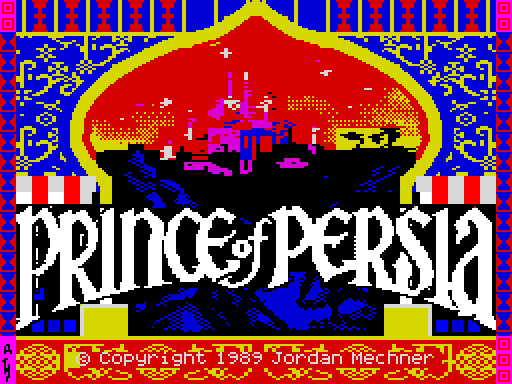
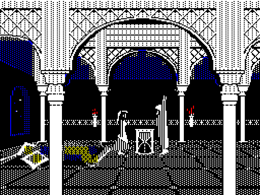
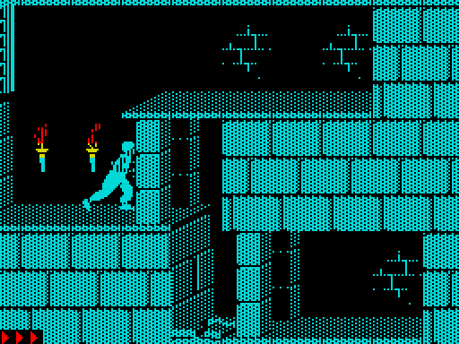
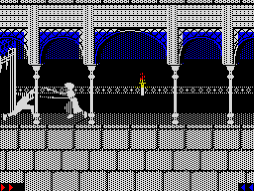
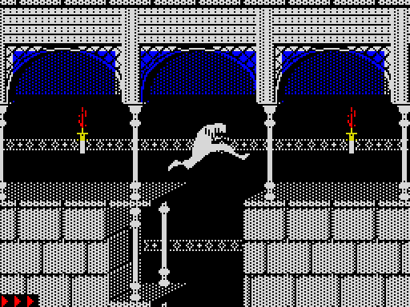
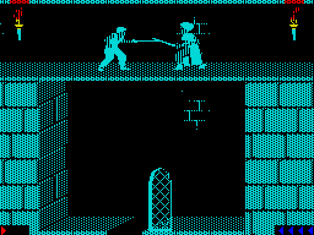

# Prince of Persia — ZX Spectrum 128K

A port of Jordan Mechner's **Prince of Persia** (Apple II, 1989) to the **ZX Spectrum 128K**,
written in Z80 assembly on top of the original 6502 source code published in this repository.

The game logic is ported from the Apple II sources (`01 POP Source`) routine by routine rather than
re-imagined: the prince's and the guards' movement, the sword fighting, traps, loose floors,
potions, the shadow, the cut scenes and the level blueprints all follow the original.
Graphics, level data and animations are converted from the Apple II disk by the tools in
[zx/tools](zx/tools).

Ported by **Sergey Potapov** — YouTube: [@16BitMaster](https://www.youtube.com/@16BitMaster)

## Screenshots

| | |
|:---:|:---:|
|  |  |
| Title screen | The princess and Jaffar, who turns the hourglass |
|  |  |
| Level 1: the dungeon | Level 4: a sword fight with a guard in the palace |
|  |  |
| Level 4: a running jump over a chasm | Level 13: the duel with Jaffar |

## What is in

- All 14 levels and the ending, the dungeon and palace graphics sets
- The title sequence, the story screens and the princess scenes between levels
- Guards, the skeleton, the fat guard, the shadowman and Jaffar, with the original fighting AI
- Gates, pressure plates, spikes, slicers, loose and falling floors, potions, the mirror
- Music and sound effects on the AY chip
- Runs at the original game speed; on turbo machines (7/14 MHz) the pace stays the same and only gets smoother

## Playing

The game needs a **ZX Spectrum 128K** (or +2 / +3, or an emulator in 128K mode, e.g. Fuse).
Load the tape with the 128K loader. The tape has a loader of its own: the title screen comes in first,
and then the rest loads with a per cent counter at the bottom left. It reads the tape at the ROM's
speed, but not through the ROM, so an emulator's ROM fast-loading does not apply to it (in Fuse,
"Accelerate loaders" speeds it up). After level one the game reads each next level from the tape
itself, so leave the tape in and let it play on when a level is finished.

| Key | Action |
|---|---|
| `5` / `8` | left / right |
| `7` | up: jump, climb up; parry in a fight |
| `6` | down: crouch, climb down; sheathe the sword |
| `Space` | the button: careful step, hang on to a ledge, pick up the sword, drink a potion; strike in a fight |

Emulators map the PC cursor keys to Caps Shift + 5/6/7/8, which works as well.

## Building

The build runs on Windows (Git Bash or any `sh`) with Python 3:

```sh
cd zx
sh build.sh
```

`build.sh` exports the graphics and levels from the Apple II data, assembles `zx/src/pop.asm` and
writes the tape to `zx/build/pop.tap`. The assembler [pasmo](https://pasmo.speccy.org/) is expected
as `zx/tools/pasmo.exe` and is not included in the repository.

## Repository layout

| Path | Contents |
|---|---|
| `01 POP Source` … `04 Support` | The original Apple II source code and data by Jordan Mechner |
| `zx/src` | The Spectrum port, Z80 assembly |
| `zx/tools` | Asset converters, the tape builder and a Z80 emulator used for testing |
| `zx/sound` | Reference recordings of the sound effects |
| `screenshots` | The pictures above |

## Rights

Prince of Persia is © Jordan Mechner, and the franchise belongs to Ubisoft. This is a
non-commercial fan port made for fun and for the history of the 8-bit machines; it carries no
rights to Prince of Persia of any kind. See Jordan Mechner's notes on the source code below.

---

## The original: Prince of Persia Apple II

Some background: This archive contains the source code for the original Prince of Persia game that I wrote on the Apple II, in 6502 assembly language, between 1985-89. The game was first released by Broderbund Software in 1989, and is part of the ongoing Ubisoft game franchise.

For a capsule summary of Prince of Persia's 35-year history, and my involvement with its various incarnations, see [jordanmechner.com](https://jordanmechner.com/).

For those interested in a fuller understanding of the context -- creative, business, personal, and technical -- in which this source code was created, I've [published my dev journals](https://jordanmechner.com/en/books/journals) from that period. I've also written and drawn a graphic novel, [REPLAY (2023)](https://jordanmechner.com/en/books/replay), in which I recount my Apple II game-development adventures in the context of my personal and family story (with a snippet of 6502 code on page 73).

For those who'd like to dig into the source code itself, I've posted an explanatory technical document at [jordanmechner.com/library](https://jordanmechner.com/en/library) which should help. This is a package I put together in October 1989 for the benefit of the teams that were undertaking the ports of POP to various platforms such as PC, Amiga, Sega, Genesis, etc.

Beyond that, please don't ask me to explain anything about the source code, because I don't remember! I hung up my 6502 programming guns in October 1989, and after two decades working primarily as a writer, game designer, and creative director, to say my coding skills are rusty would be an understatement.

Thanks to [The Internet Archive's](https://archive.org) [Jason Scott](http://www.textfiles.com) and the late [Tony Diaz](http://www.apple2.org) for successfully extracting the source code from a 22-year-old 3.5" floppy disk archive, a task that took most of a long day and night, and would have taken much longer if not for Tony's incredible expertise, perseverence, and well-maintained collection of vintage Apple hardware.

We extracted and posted the 6502 code because it was a piece of computer history that could be of interest to others, and because if we hadn't, it might have been lost for all time. We did this for fun, not profit. As the author and copyright holder of this source code, I personally have no problem with anyone studying it, modifying it, attempting to run it, etc. Please understand that this does NOT constitute a grant of rights of any kind in Prince of Persia, which is an ongoing Ubisoft game franchise. Ubisoft alone has the right to make and distribute Prince of Persia games.

That's about all I know. If additional information becomes available, I'll post about it. My current social media account links are on the home page of [jordanmechner.com](https://jordanmechner.com), along with my monthly email newsletter and RSS feed. In the meantime, if you have questions -- technical, legal, or otherwise -- I recommend that you direct them to the community at large, whose collective knowledge and expertise far exceeds mine, and will only increase as more people get their eyes on this code.

As for me, it's time to get back to my day job of making new games and making up stories.

Have fun!

-- Jordan Mechner (Updated September 2024)
